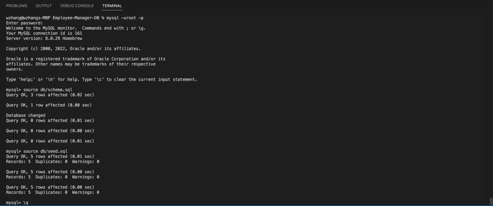

# Employee Tracker

[](#license)

A CLI application to manage a company's employee database, using Node.js, Inquirer, and MySQL.

## Description 
This application is a command line application content management system which allows the user to manage a database of company information including departments, roles, and employees. 

## Technologies Used

- [Node.js](https://nodejs.org/)
- [MySQL](https://www.mysql.com/)


## Table of Contents

* [Installation](#installation)
* [Usage](#usage)
* [Credits](#credits)
* [License](#license)
* [Contributing](#contributing)

## Installation
  1. Upload all files or fork this repository to a server with a Node.js runtime environment and a MySQL Server. 
  2. Run `npm -i` from the root directory to install dependencies for this app. 
  3. From the root directory, open MySQL Shell and run `source ./db/schema.sql;` to create the database schema.
      - Optionally run `source ./db/schema.sql;` to populate the database with sample data.
  4. Run `npm start` to start the app in the command line.
  5. For the first time running, follow the prompts to enter your MySQL login info.

## Usage 
Run `npm start` to start the app in the command line.

Follow the prompts in the application to use the content management system.


Walthrough Video: [Here](https://drive.google.com/file/d/1SpSDg5x-_2od2fX4HxYiDquy12aEJd-f/view?usp=sharing)

## Credits
This application was built with the support of the resources and staff of the UCB Full Stack Full Time Coding Bootcamp Summer 2022. 

-W3 Schools


## License

```
MIT License
```

</details>

## Contributing
This project isn't currently acccepting contributions.

## Questions
- View my Github [profile](https://github.com/jeffz98)
- Contact me at my [email](mailto:jeffz98@berkeley.edu)